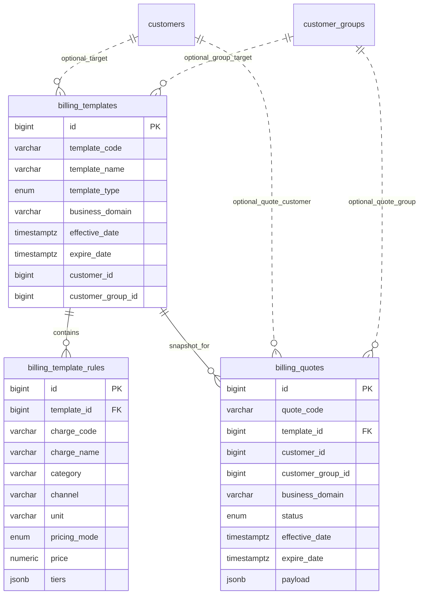

# 计费配置后端开发说明（与前端对接）

面向前端《docs/billing-api-integration.md》的接口需求，结合后端分层与现有客户/分组能力，给出计费模板（含报价单）后端设计与约束。

## 1. 目标与范围
- 提供计费模板 CRUD、列表/详情查询接口，契合前端 tab（GLOBAL/GROUP/CUSTOMER）。
- 模板规则包含收费项、计价方式、阶梯价等结构化字段。
- 支持客户/分组关联过滤；模板保存时立即生成报价单快照（见 §5）。
- 利用报价单快照表保证模板与计费结果的一致性，不再额外维护版本号。

## 2. 领域模型
- `BillingTemplate`：计费模板主实体，类型 `GLOBAL | GROUP | CUSTOMER`，包含 `templateCode/name/description/effectiveDate/expireDate` 等。
- `TemplateRule`：模板规则子项，含收费项、计价方式、阶梯价。
- `TemplateChargeDefinition`（可选）：收费项元数据（code/name/category/channel/unit）。
- `Quote`（报价单）：针对具体客户/分组的模板快照，字段包含 `quoteCode`、`templateId`、`scopeType`、`scopePriority`、`customerId?`、`customerGroupId?`、`status`（ACTIVE/INACTIVE）、`effectiveDate/expireDate`、`payload`（保存规则快照）。每条记录即为一个已生效的模板快照，不再额外记录版本号。

> 业务说明：模板保存即生成报价快照，不再区分草稿/启用状态。报价单的 `status` 字段用于控制生效状态。

> 业务域控制：沿用 `CurrentUser.domain_codes` 进行过滤/校验。

## 3. Template 与 TemplateRule 结构

### Template（列表/详情返回）
- `id`: bigint（主键）。
- `templateType`: `GLOBAL | GROUP | CUSTOMER`，前端 tab 必传，一致性由后端校验。
- `templateCode`: varchar（唯一）。
- `templateName`: string。
- `description`: string。
- `effectiveDate`: ISO 格式时间戳。
- `expireDate`: ISO 或 `null`，空值表示长期有效。
- `rules`: `TemplateRule[]`。
- `customerGroupId?`: `number`（仅 `GROUP`）。
- `customerId?`: `number`（仅 `CUSTOMER`）。

### TemplateRule（规则结构）
- `chargeCode`: string（如 `STORAGE_FEE`）。
- `chargeName`: string。
- `category`: `STORAGE | INBOUND_OUTBOUND | TRANSPORT | RETURN | MATERIAL | MANUAL`。
- `channel`: `AUTO | SCAN | MANUAL`。
- `unit`: `PIECE | PALLET | ORDER | CBM_DAY | CBM_MONTH | KG_DAY | KG_MONTH`。
- `pricingMode`: `FLAT` 或 `TIERED`。
- `price?`: number | null（简单模式价格，可为空用于 `supportOnly` 的规则）。
- `tiers?`: `[{ minValue, maxValue | null, price, description? }]`（支持阶梯）。
- `description?`: string。
- `supportOnly?`: boolean（`TRANSPORT`/`MANUAL` 只用于标记支持状态，前端据此隐藏价格编辑）。

> 计价约束：`STORAGE` 可选 `FLAT/TIERED`；`INBOUND_OUTBOUND`/`RETURN`/`MATERIAL` 仅 `FLAT`；`TRANSPORT` 与 `MANUAL` 仅 `supportOnly=true`，`price=null`，前端只展示可否支持的开关。

### Template Create/Update Payload
- 基本与 `Template` 保持一致，更新时可省略不可变字段（如 `templateType`/`templateCode`）。
- `customerGroupId` 仅 `GROUP`，`customerId` 仅 `CUSTOMER`；`GLOBAL` 类型限定最多 1 条。
- `rules` 列表在保存前必须完成参数校验（枚举、阶梯区间、价格或 `supportOnly` 标记等）。

## 4. API 契约（后端建议）
与前端文档对齐，补充后端约束：

| 功能 | 方法 | 路径 | 说明 |
| --- | --- | --- | --- |
| 列表模板 | GET `/api/v1/billing/templates` | `templateType` 必传，支持 `keyword/customerId/customerGroupId/limit/offset`，返回 `items: Template[]` 与 `total`；按业务域过滤 |
| 获取详情 | GET `/api/v1/billing/templates/{id}` | 返回 `Template`（含 `rules` 及关联客户/分组） |
| 新增模板 | POST `/api/v1/billing/templates` | 传入 `Template` 结构；`templateType`/`templateCode` 必填、`customerId` 仅 CUSTOMER、`customerGroupId` 仅 GROUP，`templateCode` 唯一；**保存时立即生成报价单** |
| 更新模板 | PUT `/api/v1/billing/templates/{id}` | 禁止修改 `templateType/templateCode`；`rules` 全量替换；**更新时旧报价单标记 INACTIVE，生成新报价单** |
| 删除模板 | DELETE `/api/v1/billing/templates/{id}` | 软删并返回 204；关联报价单标记为 INACTIVE |
| 列表报价单 | GET `/api/v1/billing/quotes` | 支持按 `templateId/customerId/customerGroupId/status` 过滤（可选，用于计费消费侧） |
| 获取报价单 | GET `/api/v1/billing/quotes/{id}` | 返回已快照的规则与 `payload` 元信息（可选） |

## 5. 报价单快照策略
- **报价单快照**：模板保存时（创建/更新）立即生成一条 `Quote` 记录，该记录携带模板与规则的完整 JSON 快照，避免后续模板编辑影响正在生效的计费。
  - CUSTOMER 模板：单客户生成 1 条报价单。
  - GROUP 模板：记录所关联的 customer_group_id，生成 1 条报价单（后续可扩展为拆分成员）。
  - GLOBAL 模板：生成 1 条全局报价单。
- **保存时机**：
  - **创建模板**：保存时生成 ACTIVE 状态的报价单。
  - **更新模板**：旧报价单标记为 INACTIVE，生成新的 ACTIVE 报价单。
  - **删除模板**：软删模板，关联报价单标记为 INACTIVE。
- **字段建议**：`payload` 字段存储模板和规则的 JSON 快照，不再额外写入版本号；其它关键字段为 `scope_type` / `scope_priority` / `status` / `effective_date` / `expire_date`。
- **作用域优先级**：报价单只保存在 `billing_quotes` 表里，根据模板类型写入 `scope_type=CUSTOMER|GROUP|GLOBAL` 与 `scope_priority`（`CUSTOMER=3`、`GROUP=2`、`GLOBAL=1`）。每个作用域同时最多 1 条 `ACTIVE` 快照，更新模板时把旧快照标记 `INACTIVE`，保证查询时不会返回多条冲突记录。
- **生效判断**：系统始终以 `status='ACTIVE'` + 当前时间窗口 (`effective_date <= now() < expire_date/null`) 判定报价单是否生效。业务上要求客户单独报价优先，其次客户组，最后 GLOBAL。

此设计确保：模板编辑不影响已生效计费，已生效的报价通过 `billing_quotes` 记录持续可查。

## 6. 校验与约束
- 生效期校验：`effectiveDate <= expireDate`；`expireDate` 可为空（长期有效）。
- 唯一性：`templateCode` 全局唯一；GLOBAL 类型限制单条（后端阻断）。
- 业务域：查询与写入时校验 `BusinessDomainGuard`，按域过滤列表。
- 关联校验：
  - CUSTOMER 模板必须指定 `customerId`，不能指定 `customerGroupId`
  - GROUP 模板必须指定 `customerGroupId`，不能指定 `customerId`
  - GLOBAL 模板不能指定 `customerId` 和 `customerGroupId`

## 7. 数据层与事务
- ER 图：



- Postgres 模型建议（字段名/类型/约束）：
  - `billing_templates`
    - `id` bigint PK
    - `template_code` varchar(64) UNIQUE NOT NULL
    - `template_name` varchar(128) NOT NULL
    - `template_type` varchar(16) NOT NULL (`GLOBAL`/`GROUP`/`CUSTOMER`)
    - `business_domain` varchar(64) NOT NULL
    - `description` varchar(512)
    - `effective_date` timestamptz NOT NULL
    - `expire_date` timestamptz NULL
    - `customer_id` bigint NULL (仅 CUSTOMER)
    - `customer_group_id` bigint NULL (仅 GROUP)
    - 审计/软删字段：`created_at/updated_at/deleted_at/created_by/is_deleted/...`
    - 索引：`idx_billing_template_type`，`idx_billing_template_customer`，`idx_billing_template_group` (gin on jsonb)
  - `billing_template_rules`
    - `id` bigint PK
    - `template_id` bigint FK -> `billing_templates.id` ON DELETE CASCADE
    - `charge_code` varchar(64) NOT NULL
    - `charge_name` varchar(128) NOT NULL
    - `category` varchar(32) NOT NULL
    - `channel` varchar(32) NOT NULL
    - `unit` varchar(32) NOT NULL
    - `pricing_mode` enum(`FLAT`,`TIERED`) NOT NULL
    - `price` numeric(18,4) NULL
    - `tiers` jsonb NULL [{minValue,maxValue,price,description}]
    - `description` varchar(512)
    - 审计字段同上；索引 `idx_template_rules_template_id`
  - `billing_quotes`
    - `id` bigint PK
    - `quote_code` varchar(64) UNIQUE NOT NULL
    - `template_id` bigint FK -> `billing_templates.id`
    - `scope_type` enum(`CUSTOMER`,`GROUP`,`GLOBAL`) NOT NULL（区分作用域）
    - `scope_priority` smallint NOT NULL（默认 CUSTOMER=3、GROUP=2、GLOBAL=1）
    - `customer_id` bigint NULL
    - `customer_group_id` bigint NULL
    - `business_domain` varchar(64) NOT NULL
    - `status` varchar(16) NOT NULL (`ACTIVE`/`INACTIVE`)
    - `effective_date` timestamptz NOT NULL
    - `expire_date` timestamptz NULL
    - `payload` jsonb NOT NULL（模板+规则快照）
    - 审计/软删字段同上；索引：`idx_billing_quotes_template_id`，`idx_billing_quotes_customer`，`idx_billing_quotes_group`
- SQLAlchemy 模型可继承现有 `AuditMixin`/`Base`，枚举类型与字符串常量在 `domain.billing` 定义；`customer_group_id` 作为简单 FK 绑定 `customer_groups`。
- 事务：模板及规则增改在同一事务；保存模板时生成报价单与模板更新同事务提交。

## 8. 对接与测试要点
- 列表/详情返回字段与前端文档一致，增加 `trace_id` header。
- 保存（创建/更新）模板时返回最新的模板数据（包含规则快照），以便前端刷新列表。
- 报价单接口用于计费侧消费，需验证快照内容与模板一致。
- 报价生效查询：后端提供统一查询逻辑，只需一次 SQL 即可判断客户当前生效报价，示例：

  ```sql
  SELECT *
  FROM billing_quotes
  WHERE status = 'ACTIVE'
    AND is_deleted = false
    AND effective_date <= now()
    AND (expire_date IS NULL OR expire_date > now())
    AND (
          (scope_type = 'CUSTOMER' AND customer_id = :customer_id)
       OR (scope_type = 'GROUP' AND customer_group_id = :group_id)
       OR (scope_type = 'GLOBAL')
        )
  ORDER BY scope_priority DESC, effective_date DESC
  LIMIT 1;
  ```

  其中 `group_id` 在请求前一次性获取（客户只隶属单个组），查询返回的第一条即为当前生效报价，可据此判断来自独立、组或全局模板。
- 覆盖用例：模板创建/更新/删除、报价单自动生成与查询、业务域过滤、GLOBAL 唯一性。

## 9. 后续可选
- 审核流：在报价单上增加 `REVIEWING` 状态与审批接口（需扩展报价单状态枚举）。
- 历史版本：`GET /billing/templates/{id}/versions`，或通过查询关联报价单历史实现。
- 收费项元数据：提供 `/billing/charges` 返回可选收费项定义（code/name/category/channel/unit/默认描述）。
