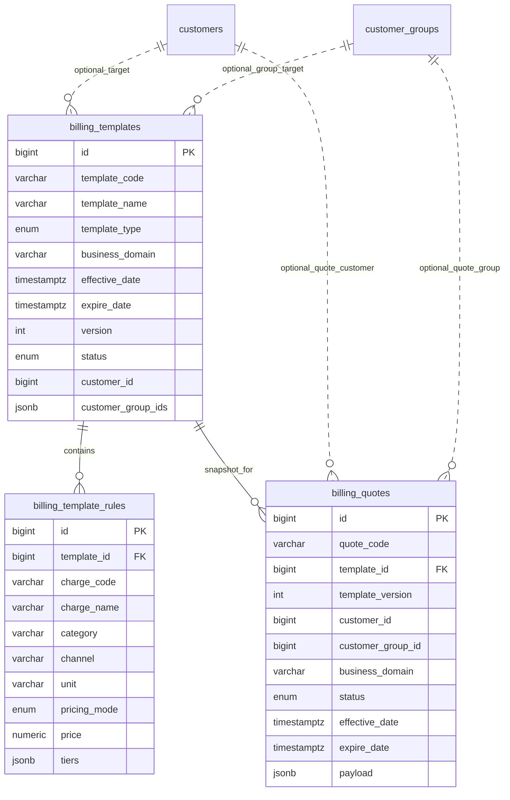

# 计费配置后端开发说明（与前端对接）

面向前端《docs/billing-api-integration.md》的接口需求，结合后端分层与现有客户/分组能力，给出计费模板（含报价单）后端设计与约束。

## 1. 目标与范围
- 提供计费模板 CRUD、状态切换、列表/详情查询接口，契合前端 tab（GLOBAL/GROUP/CUSTOMER）。
- 模板规则包含收费项、计价方式、阶梯价等结构化字段。
- 支持客户/分组关联过滤；对 CUSTOMER 模板在生效时生成报价单快照（见 §4）。
- 保证模板/报价单的版本与并发一致性（乐观锁）。

## 2. 领域模型
- `BillingTemplate`：计费模板主实体，类型 `GLOBAL | GROUP | CUSTOMER`，包含 `templateCode/name/description/effectiveDate/expireDate/version/status` 等。
- `TemplateRule`：模板规则子项，含收费项、计价方式、阶梯价。
- `TemplateChargeDefinition`（可选）：收费项元数据（code/name/category/channel/unit）。
- `Quote`（报价单）：针对具体客户/分组的模板快照，字段包含 `quoteCode`、`templateId`、`templateVersion`、`customerId?`、`customerGroupId?`、`status`、`effectiveDate/expireDate`、`payload`（保存规则快照）。

> 业务域控制：沿用 `CurrentUser.domain_codes` 进行过滤/校验。

## 3. API 契约（后端建议）
与前端文档对齐，补充后端约束：

| 功能 | 方法 | 路径 | 说明 |
| --- | --- | --- | --- |
| 列表模板 | GET `/api/v1/billing/templates` | 支持 `templateType/keyword/status/customerId/customerGroupId/limit/offset`，按业务域过滤 |
| 获取详情 | GET `/api/v1/billing/templates/{id}` | 返回模板 + 规则 |
| 新增模板 | POST `/api/v1/billing/templates` | `templateType` 必填；`customerId` 仅 CUSTOMER，`customerGroupIds` 仅 GROUP；`templateCode` 唯一 |
| 更新模板 | PUT `/api/v1/billing/templates/{id}` | 禁止修改 `templateType/templateCode`；乐观锁校验 `version` |
| 删除模板 | DELETE `/api/v1/billing/templates/{id}` | 软删；若已关联报价单则阻断或转为失效 |
| 启用/停用 | PATCH `/api/v1/billing/templates/{id}/status` | 状态流转：`DRAFT -> ACTIVE/INACTIVE`，`ACTIVE -> INACTIVE`；切换到 `ACTIVE` 时触发报价单快照（见 §4） |
| 列表报价单 | GET `/api/v1/billing/quotes` | 支持按 `customerId/customerGroupId/templateId/status` 过滤 |
| 获取报价单 | GET `/api/v1/billing/quotes/{id}` | 返回已快照的规则 |

## 4. 版本与报价单策略（回答「是否保存时为每个客户生成报价单并放版本」）
- **模板主版本**：`BillingTemplate.version` 用于乐观锁与模板迭代。
- **报价单快照**（推荐）：在模板进入 `ACTIVE` 时为目标客户/分组生成 `Quote` 记录，写入 `templateVersion` 与规则快照，避免后续模板编辑影响已生效计费。
  - CUSTOMER 模板：单客户生成 1 条报价单。
  - GROUP 模板：对所选分组生成 1 条报价单（若后续需要按组成员拆分，可扩展为每成员生成）。
  - GLOBAL 模板：可生成 1 条全局报价单或跳过，视计费消费侧需求。
- **保存时机**：不在「保存草稿」阶段生成报价单，只在「激活/启用」时生成；更新已启用模板会新增一版模板并生成新的报价单，旧报价单可标记 `INACTIVE` 或保留历史。
- **字段建议**：`Quote.templateVersion` 存放模板版本，`payload` 存模板与规则的 JSON 快照，确保计费计算按快照执行。
- **作用域优先级**：报价单只保存在 `billing_quotes` 表里，根据模板类型写入 `scope_type=CUSTOMER|GROUP|GLOBAL`（或等价常量）与 `scope_priority`（示例：`CUSTOMER=3`、`GROUP=2`、`GLOBAL=1`）。每个作用域同时最多 1 条 `ACTIVE` 快照，激活新版本时把旧快照标记 `INACTIVE` 或缩短 `expire_date`，保证查询时不会返回多条冲突记录。
- **生效判断**：系统始终以 `status='ACTIVE'` + 当前时间窗口 (`effective_date <= now() < expire_date/null`) 判定是否生效。业务上要求客户单独报价优先，其次客户组，最后 GLOBAL。

此设计比“仅模板版本字段”更稳健：避免模板编辑覆盖已生效计费，且支持按客户留存历史版本。

## 5. 状态与校验
- 模板状态机：`DRAFT` → `ACTIVE` → `INACTIVE`；禁止直接从 `INACTIVE` 回到 `ACTIVE`，需复制/新建。
- 生效期校验：`effectiveDate <= expireDate`；`expireDate` 可为空（长期有效）。
- 唯一性：`templateCode` 全局唯一；GLOBAL 类型限制单条（后端阻断）。
- 业务域：查询与写入时校验 `BusinessDomainGuard`，按域过滤列表。
- 并发：更新/状态切换需携带 `version`；返回 409 时提示前端重拉。

## 6. 数据层与事务
- ER 图：



- Postgres 模型建议（字段名/类型/约束）：
  - `billing_templates`
    - `id` bigint PK
    - `template_code` varchar(64) UNIQUE NOT NULL
    - `template_name` varchar(128) NOT NULL
    - `template_type` enum(`GLOBAL`,`GROUP`,`CUSTOMER`) NOT NULL
    - `business_domain` varchar(64) NOT NULL
    - `description` varchar(512)
    - `effective_date` timestamptz NOT NULL
    - `expire_date` timestamptz NULL
    - `version` int NOT NULL default 1
    - `status` enum(`DRAFT`,`ACTIVE`,`INACTIVE`) NOT NULL
    - `customer_id` bigint NULL (仅 CUSTOMER)
    - `customer_group_ids` jsonb NULL (仅 GROUP，数组存组 id)
    - 审计/软删字段：`created_at/updated_at/deleted_at/created_by/...`
    - 索引：`idx_billing_template_type`，`idx_billing_template_customer`，`idx_billing_template_group` (gin on jsonb)
  - `billing_template_rules`
    - `id` bigint PK
    - `template_id` bigint FK -> `billing_templates.id` ON DELETE CASCADE
    - `charge_code` varchar(64) NOT NULL
    - `charge_name` varchar(128) NOT NULL
    - `category` varchar(32) NOT NULL
    - `channel` varchar(32) NOT NULL
    - `unit` varchar(32) NOT NULL
    - `pricing_mode` enum(`FLAT`,`TIERED`) NOT NULL
    - `price` numeric(18,4) NULL
    - `tiers` jsonb NULL [{minValue,maxValue,price,description}]
    - `description` varchar(512)
    - 审计字段同上；索引 `idx_template_rules_template_id`
  - `billing_quotes`
    - `id` bigint PK
    - `quote_code` varchar(64) UNIQUE NOT NULL
    - `template_id` bigint FK -> `billing_templates.id`
    - `template_version` int NOT NULL
    - `scope_type` enum(`CUSTOMER`,`GROUP`,`GLOBAL`) NOT NULL（区分作用域）
    - `scope_priority` smallint NOT NULL（默认 CUSTOMER=3、GROUP=2、GLOBAL=1）
    - `customer_id` bigint NULL
    - `customer_group_id` bigint NULL
    - `business_domain` varchar(64) NOT NULL
    - `status` enum(`ACTIVE`,`INACTIVE`) NOT NULL
    - `effective_date` timestamptz NOT NULL
    - `expire_date` timestamptz NULL
    - `payload` jsonb NOT NULL（模板+规则快照）
    - 审计/软删字段同上；索引：`idx_billing_quotes_template_id`，`idx_billing_quotes_customer`，`idx_billing_quotes_group`
- SQLAlchemy 模型可继承现有 `AuditMixin`/`Base`，枚举类型与字符串常量在 `domain.billing` 定义；`customer_group_ids` 推荐 gin 索引以支持包含查询。
- 事务：模板及规则增改在同一事务；启用时生成报价单与状态更新同事务提交。

## 7. 对接与测试要点
- 列表/详情返回字段与前端文档一致，增加 `trace_id` header。
- 状态切换时返回最新 `version`。
- 报价单接口用于计费侧消费，需验证快照内容与模板一致。
- 报价生效查询：后端提供统一查询逻辑，只需一次 SQL 即可判断客户当前生效报价，示例：

  ```sql
  SELECT *
  FROM billing_quotes
  WHERE status = 'ACTIVE'
    AND effective_date <= now()
    AND (expire_date IS NULL OR expire_date > now())
    AND (
          (scope_type = 'CUSTOMER' AND customer_id = :customer_id)
       OR (scope_type = 'GROUP' AND customer_group_id = :group_id)
       OR (scope_type = 'GLOBAL')
        )
  ORDER BY scope_priority DESC, effective_date DESC
  LIMIT 1;
  ```

  其中 `group_id` 在请求前一次性获取（客户只隶属单个组），查询返回的第一条即为当前生效报价，可据此判断来自独立、组或全局模板。
- 覆盖用例：模板创建/更新/启用/停用、乐观锁冲突、报价单生成与查询、业务域过滤、GLOBAL 唯一性。

## 8. 后续可选
- 审核流：在模板/报价单上增加 `REVIEWING` 状态与审批接口。
- 历史版本：`GET /billing/templates/{id}/versions`，或直接查询关联报价单历史。
- 收费项元数据：提供 `/billing/charges` 返回可选收费项定义。
