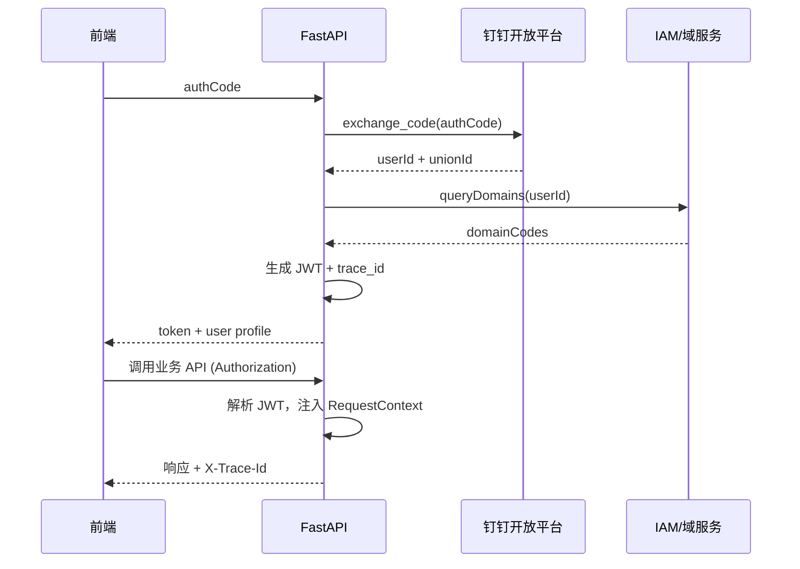

# 钉钉认证接入开发说明

本文在 AGENTS.md 构建约束与 DDD 分层基础上，说明如何在 FastAPI 服务中集成钉钉认证，并输出 RequestContext 所需的租户/域信息。

## 业务背景

- 仓储计费后台依赖钉钉作为统一身份认证与授权中心。
- 需求：API 请求必须经过钉钉登录态验证，解析用户身份、权限域（BusinessDomain）与 trace 信息，并注入 `RequestContextMiddleware`。
- 最终目标：在 Presentation 层提供统一依赖，Application/Domain 仅消费 `CurrentUser`/`BusinessDomainGuard`，避免散落钉钉 SDK 调用。

## 集成策略

1. **OAuth2 免登/扫码**：前端通过钉钉提供的 `authCode` 交换 `accessToken` + `userInfo`，后端只需校验并换取内部 JWT。
2. **服务器端验证**：后端维护 `DingTalkAuthGateway`，封装钉钉开放平台接口（`getuserinfo_bycode`、`user/get` 等）。
3. **JWT 网关**：后端使用 `shared/config` 的签名密钥生成内部 JWT，在 RequestContext 中解析。
4. **权限域控制**：钉钉组织关系 → IAM 服务 → `BusinessDomainGuard`。如果 IAM 尚未完成，先预留接口。

## 分层设计

### Infrastructure

- `src/infrastructure/auth/dingtalk_gateway.py`
  - 方法：`exchange_code(auth_code: str) -> DingTalkUserPayload`
  - 使用 `httpx.AsyncClient` 调用钉钉接口，结构化错误。
- `src/infrastructure/auth/token_service.py`
  - 生成/校验内部 JWT，包含 `user_id`,`union_id`,`domain_codes`,`trace_id`。

### Application

- `AuthenticateUserUseCase`
  1. 调用 `DingTalkAuthGateway.exchange_code`
  2. 查询/创建本地 `User`（未来 Infrastructure DB 实现）
  3. 聚合同步 `BusinessDomain` 权限
  4. 生成内部 JWT + Refresh Token
- `AuthorizeRequestService`
  - 校验请求头 `Authorization`，解析 JWT，构造 `CurrentUser` 传给 Presentation。

### Presentation

- 新增 `Depends(get_current_user)`，在路由层注入。
- `RequestContextMiddleware` 更新：
  - 从 JWT 读取 `trace_id` 或生成 UUID
  - 将 `CurrentUser` 写入 `contextvars`
  - 注入 `business_domain_codes`，供查询过滤

## 流程图

## 安全与最佳实践

- 使用 `uv run` 执行命令，Secrets 存放 `.env`：`DINGTALK_APP_KEY`、`DINGTALK_APP_SECRET`，并在 `shared/config` 注册。
- 针对钉钉接口调用配置指数退避与熔断，避免影响主流程。
- JWT 过期策略：Access Token 1h，Refresh Token 7d，刷新流程走 `POST /auth/refresh`。
- `trace_id`：如果钉钉 header 提供 `x-tt-traceid`，沿用；否则生成新 UUID。
- 审计：使用 structlog 绑定 `ding_user_id`、`union_id`，便于排查。

## 开发环境策略（无钉钉接入）

- **伪造 Gateway**：在 `settings.app_env == "dev"` 时，`DingTalkAuthGateway` 返回固定用户 payload（可从 `.env` 中读取 `MOCK_USER_ID`、`MOCK_DOMAIN_CODES`），并记录 warning 日志。
- **本地 JWT**：提供 `POST /auth/dev-login`，仅 dev 环境可用，允许传入 `userId`、`domainCodes` 生成内部 JWT，方便前端调试。
- **安全边界**：确保 dev-only 接口在生产环境自动禁用，CI/CD 在部署前校验 `APP_ENV`。
- **测试对齐**：集成测试使用 dev mock，以便覆盖 RequestContext 注入流程；E2E/灰度环境必须走真实钉钉 OAuth。

## 测试建议

- 模拟钉钉响应（httpx MockTransport），验证 `AuthenticateUserUseCase` 的成功/失败路径。
- Presentation 层集成测试：使用 FastAPI TestClient 注入假 JWT，确保 `RequestContextMiddleware` 正常写入 `trace_id`。
- 负载场景：使用 `locust`/`k6` 模拟高并发，验证 gateway 的连接池和超时配置。

## 待办与风险

- IAM 尚未提供业务域接口，需 mock 或临时配置。
- 若钉钉接口限流，需提前接入缓存或本地用户映射以降低频次。
- 需要完善日志脱敏策略（隐藏 `unionId` 等敏感字段）。
