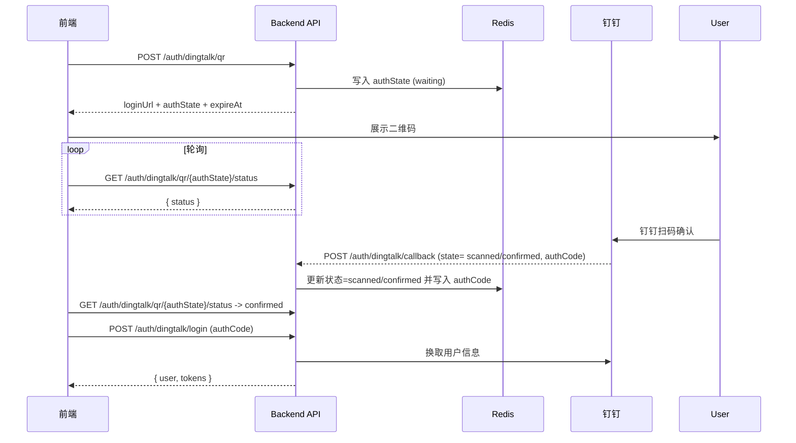

# 钉钉扫码登录后端接口设计

## 1. 背景与目标

- 新增钉钉扫码登录后端能力，与现有邮箱/密码登录并行。
- 二维码有效期固定为 2 分钟，扫码到登录全链路控制在 5 秒内。

## 2. 后端总体流程

1. `POST /api/v1/auth/dingtalk/qr` 生成一次性 `auth_state`，使用配置项 `DINGTALK_QR_REDIRECT_URI` 拼装钉钉 OAuth 参数（`response_type=code`、`client_id=settings.dingtalk_app_key`、`redirect_uri=settings.dingtalk_qr_redirect_uri`、`scope=openid`、`prompt=consent`、`state=auth_state`），通过 `urlencode` 得到 `loginUrl` 返回前端，并将 `auth_state` 与状态（waiting）写入 Redis（含过期时间）。
2. 前端渲染二维码并开始轮询 `GET /api/v1/auth/dingtalk/qr/{authState}/status`。
3. 当用户用钉钉 APP 扫码并确认后，钉钉回调后端接口，后端校验 `state`、生成一次性 `authCode`，更新 Redis 中 `auth_state` 状态为 `confirmed` 并写入 `authCode`。
4. 前端轮询读到 `confirmed` 状态时，调用现有 `POST /api/v1/auth/dingtalk/login` 携带 `authCode` 换取系统内的 token；本地系统不维护用户主体，后端将使用钉钉回调带来的 `authCode` 去换取钉钉用户信息并直接生成登录态。
5. 若 `auth_state` 超时或用户刷新二维码，后端需要清理旧状态并生成新的 `auth_state`。

## 3. 状态存储

- 使用 Redis 缓存二维码状态：`authState -> { status, authCode?, expireAt }`。
- 状态枚举：`waiting`、`scanned`、`confirmed`、`expired`。
- 钉钉客户端完成扫码并在钉钉端确认后，钉钉会回调后端，后端在回调入口根据回传状态将 Redis 中的 `auth_state` 从 `waiting` 更新为 `scanned`，随后在用户确认授权后更新为 `confirmed` 并写入一次性 `authCode`；超时依赖 Redis TTL 自动清除。
- 若状态更新失败（网络波动或 Redis 写入失败），由后端进行重试或回滚，确保状态转换的幂等性。
- 平台不维护独立用户表，`authCode` 换取的钉钉用户信息将直接作为登录依据。

## 4. API 契约

| 接口 | 方法 | 入参 | 响应 | 说明 |
| --- | --- | --- | --- | --- |
| `/api/v1/auth/dingtalk/qr` | `POST` | `{ clientType: 'pc' }` | `{ authState: string, loginUrl: string, expireAt: string }` | 生成一次性二维码 URL，写入 Redis；首期仅支持 PC |
| `/api/v1/auth/dingtalk/qr/{authState}/status` | `GET` | path `authState` | `{ status: 'waiting'\|'scanned'\|'confirmed'\|'expired', authCode?: string }` | 读取 Redis 状态；`authCode` 仅在 confirmed 返回 |
| `/api/v1/auth/dingtalk/callback` | `POST` | `{ state: string, status: 'scanned'\|'confirmed', authCode?: string }` | `{ ok: true }` | 钉钉服务端回调入口（必须实现），更新 Redis 中状态及 `authCode` |
| `/api/v1/auth/dingtalk/login` | `POST` | `{ authCode: string }` | `{ user: CurrentUser, tokens: TokenPair }` | 调用钉钉开放平台换取用户信息并直接生成登录态，`authCode` 仅使用一次，响应以 JSON 返回 |

安全要求：
- 后端生成 `loginUrl` 时，`redirect_uri` 必须在钉钉控制台配置，`state` 与 `auth_state` 一致。
- 所有接口需要 CSRF/Referer 校验；`authCode` 只能使用一次。（TODO：补充各接口对应的 token/nonce 校验方式）
- Redis key TTL 与二维码有效期保持一致（2 分钟），到期后依赖 Redis 自动清理。
- `/api/v1/auth/dingtalk/callback` 需按钉钉官方签名规范校验请求来源（TODO：补充具体验签算法及 header 定义）。
- 钉钉回调多次推送或处理失败时，暂仅记录日志并人工排查（后续可扩展重试/幂等策略）。

## 5. 回归 Checklist（后端视角）

1. `POST /auth/dingtalk/qr` 能生成唯一 `auth_state` 且 Redis 写入成功，`loginUrl` 可用于钉钉扫码。
2. 钉钉回调接口可正确解析参数，更新 Redis 状态及 `authCode`。
3. `GET /auth/dingtalk/qr/{authState}/status` 在不同状态下返回符合契约的数据。
4. `/auth/dingtalk/login` 校验 `authCode` 并完成登录；重复使用同一个 `authCode` 会返回错误。（TODO：补充校验逻辑与 Redis 状态删除策略）
5. Redis 里的临时数据在过期后自动清除。

## 6. 后续方向（后端）

- 钉钉 H5/容器免登录：可通过钉钉 JS SDK 调 `dd.runtime.permission.requestAuthCode` 获取 authCode，复用现有 `/auth/dingtalk/login`。
- 多平台二维码：可抽象 QR 登录接口层，替换不同平台的 OAuth URL 与回调逻辑。

## 7. 待办事项

1. **回调验签**：`/api/v1/auth/dingtalk/callback` 尚未对 `timestamp`/`sign` 等钉钉校验字段做验证，需要补充验签逻辑、防重放策略与白名单配置。
2. **CSRF/Referer 方案**：`POST /auth/dingtalk/qr` 与轮询接口目前无 CSRF token 校验，需结合现有登录实现设计 token/nonce，并在客户端配合发送。
3. **authCode 策略**：当前直接保留钉钉回调传入的 `authCode`，未实现一次性校验、过期策略，以及与 `/auth/dingtalk/login` 的清理流程，需明确存储/消费规范。
4. **错误与重试**：钉钉回调失败仅记录日志，缺少告警/重放机制；轮询接口也未对 Redis 缺失状态做兜底处理。
5. **测试覆盖**：二维码状态仓储、`DingTalkQrLoginService`、新路由等均缺少单元/集成测试，需补足。
6. **前端约束更新**：前端文档需同步 authState 命名、回调入参及接口格式。 
