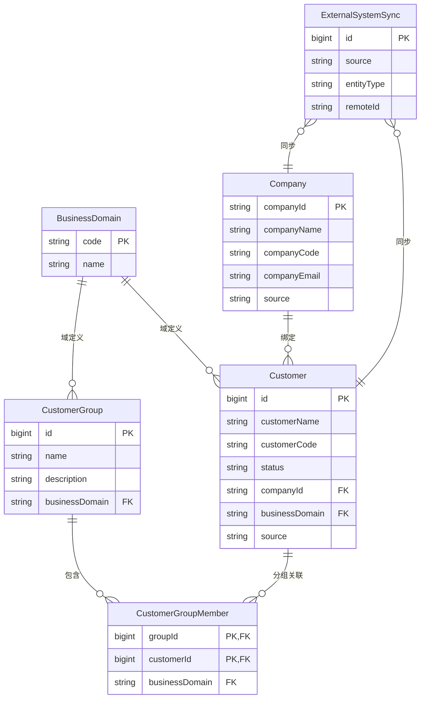

# 客户管理与客户关系 ER 文档

## 背景

客户域覆盖基础客户档案、客户分组（CRM 触点）以及外部企业信息。当前数据由 `Zustand` store 基于本地 mock 数据提供，但字段契约已经与后端 API 协议对齐，可直接映射为数据库实体。

## 实体概览

| 实体                  | 说明                                   | 主键                            | 关键字段                                              |
| --------------------- | -------------------------------------- | ------------------------------- | ----------------------------------------------------- |
| `Customer`            | 仓储计费系统内的客户档案               | `id`                            | `customerName`、`customerCode`、`status`、`companyId` |
| `Company`             | 主体公司信息，既可由 RB 导入也支持自建 | `companyId`                     | `companyName`、`companyCode`、`source`                |
| `CustomerGroup`       | CRM 分组，用于圈选客户、控制运营流程   | `id`                            | `name`、`businessDomain`                              |
| `CustomerGroupMember` | 客户与分组的多对多关联表               | 复合键 (`groupId`,`customerId`) | `groupId`、`customerId`                               |
| `BusinessDomain`      | 定义普通仓、保税仓等业务域             | `code`                          | `name`、`description`                                 |
| `ExternalSystemSync`  | 记录来自各来源的数据映射               | `id`                            | `source`、`entityType`、`remoteId`                    |

> 说明：代码中 `CustomerGroup` 结构包含 `customerIds` 数组，数据库实现应转化为独立的关联表 `CustomerGroupMember` 以保持范式。

## 字段定义

### `Customer`

| 字段              | 类型                        | 约束                        | 说明                                                      |
| ----------------- | --------------------------- | --------------------------- | --------------------------------------------------------- |
| `id`              | `bigint`                    | PK，自增                    | 系统内部客户主键                                          |
| `customerName`    | `varchar(128)`              | NN                          | 展示名称                                                  |
| `customerCode`    | `varchar(64)`               | NN，唯一                    | 业务编码，前端用于检索                                    |
| `address`         | `varchar(256)`              | NN                          | 客户地址                                                  |
| `contactEmail`    | `varchar(128)`              | NN                          | 联系人邮箱                                                |
| `contactPerson`   | `varchar(64)`               | NN                          | 联系人姓名                                                |
| `operationName`   | `varchar(64)`               | NN                          | 最近操作人                                                |
| `operationUid`    | `varchar(64)`               | NN                          | 最近操作人 UID                                            |
| `status`          | `enum('ACTIVE','INACTIVE')` | NN                          | 客户状态                                                  |
| `companyId`       | `varchar(64)`               | FK -> `Company.companyId`   | 关联主体公司，导入流程与客户记录同事务写入                |
| `businessDomain`  | `varchar(64)`               | FK -> `BusinessDomain.code` | 业务域，如普通仓/保税仓                                   |
| `source`          | `varchar(32)`               | NN                          | 数据来源（如 `RB`、`AB`、`SB`、`INTERNAL`、`PARTNER` 等） |
| `sourceRefId`     | `varchar(128)`              | 可空                        | 外部系统主键/标识（如 RB/AB/SB 的 `company_id`）          |
| `bondedLicenseNo` | `varchar(64)`               | 可空                        | 保税客户许可编号                                          |
| `customsCode`     | `varchar(64)`               | 可空                        | 客户海关编码                                              |

### `Company`

| 字段                 | 类型           | 约束       | 说明                                                                 |
| -------------------- | -------------- | ---------- | -------------------------------------------------------------------- |
| `companyId`          | `varchar(64)`  | PK         | 系统内部主键，由平台生成；来自外部平台的记录仍需生成新的 `companyId` |
| `companyName`        | `varchar(128)` | NN         | 公司名称                                                             |
| `companyCode`        | `varchar(64)`  | NN，唯一   | 对外编码                                                             |
| `companyCorporation` | `varchar(64)`  | NN         | 法人代表                                                             |
| `companyPhone`       | `varchar(32)`  | NN         | 联系电话                                                             |
| `companyEmail`       | `varchar(128)` | NN         | 联系邮箱                                                             |
| `companyAddress`     | `varchar(256)` | NN         | 公司地址                                                             |
| `source`             | `varchar(32)`  | NN         | 数据来源（`RB`、`AB`、`SB`、`INTERNAL` 等）                          |
| `sourceRefId`        | `varchar(128)` | 可空       | 外部系统主键/标识，用于与 `companyId` 建立映射                       |
| `createdViaImport`   | `boolean`      | 默认 false | 标记是否由外部导入流程生成                                           |

> 公司实体既可以在 UI 中自建（`source=INTERNAL`），也可以由 RB/合作方导入；无论来源如何，客户在创建时都需要引用一个有效的 `companyId`。RB 导入场景下，需要先根据 `companyCode`/`sourceRefId` upsert `Company`，再在同一事务内写入 `Customer`，保证公司与客户同步落库。

### `CustomerGroup`

| 字段             | 类型           | 约束                        | 说明         |
| ---------------- | -------------- | --------------------------- | ------------ |
| `id`             | `bigint`       | PK，自增                    | 分组主键     |
| `name`           | `varchar(64)`  | NN，唯一                    | 分组名称     |
| `description`    | `varchar(256)` | 可空                        | 描述         |
| `createdAt`      | `timestamp`    | 默认当前                    | 创建时间     |
| `updatedAt`      | `timestamp`    | 自动更新                    | 最近修改时间 |
| `businessDomain` | `varchar(64)`  | FK -> `BusinessDomain.code` | 所属业务域   |

### `CustomerGroupMember`

| 字段             | 类型          | 约束                        | 说明         |
| ---------------- | ------------- | --------------------------- | ------------ |
| `groupId`        | `bigint`      | PK/FK -> `CustomerGroup.id` | 分组主键     |
| `customerId`     | `bigint`      | PK/FK -> `Customer.id`      | 客户主键     |
| `assignedAt`     | `timestamp`   | 默认当前                    | 加入分组时间 |
| `businessDomain` | `varchar(64)` | FK -> `BusinessDomain.code` | 域内隔离     |

### `BusinessDomain`

| 字段          | 类型           | 约束 | 说明                                 |
| ------------- | -------------- | ---- | ------------------------------------ |
| `code`        | `varchar(64)`  | PK   | 业务域编码，如 `GENERAL_WAREHOUSING` |
| `name`        | `varchar(64)`  | NN   | 展示名称                             |
| `description` | `varchar(256)` | 可空 | 说明                                 |

> 域权限由钉钉统一控制：业务域仅作为数据标签，后台根据钉钉提供的组织/角色判断当前用户是否可访问对应域数据，无需维护本地 `UserDomainAccess` 表。

### `ExternalSystemSync`

| 字段         | 类型           | 约束     | 说明                           |
| ------------ | -------------- | -------- | ------------------------------ |
| `id`         | `bigint`       | PK，自增 | 记录主键                       |
| `source`     | `varchar(32)`  | NN       | 外部系统                       |
| `entityType` | `varchar(64)`  | NN       | `CUSTOMER`、`COMPANY` 等       |
| `entityId`   | `bigint`       | NN       | 内部实体 ID                    |
| `remoteId`   | `varchar(128)` | NN       | 外部标识                       |
| `syncStatus` | `varchar(32)`  | NN       | `PENDING`、`SUCCESS`、`FAILED` |
| `syncedAt`   | `timestamp`    | 可空     | 最近同步时间                   |

## 关系与基数

- `Customer` ↔ `Company`：多对一，客户必须绑定一个主体公司；RB 导入时先 upsert `Company`，再在同一事务内插入 `Customer` 并引用 `companyId`。
- `Customer` ↔ `CustomerGroup`：多对多，通过 `CustomerGroupMember` 关联。
- `Customer` ↔ `BusinessDomain`：多对一，通过 `businessDomain` 字段区分普通仓/保税仓（访问控制依赖钉钉权限）。
- `ExternalSystemSync` 与各实体为一对多（按 `entityType` 关联），记录多来源同步。

## Mermaid ER 图

## 数据一致性与扩展建议

1. 在 `Customer` 表上添加 (`customerName`,`customerCode`) 组合唯一约束，防止重复。
2. `CustomerGroupMember` 建立 `idx_group_member_customer` 以支撑前端分组筛选。
3. 若后续需要 CRM 活动记录，可新增 `CustomerInteraction` 表，与客户一对多关联，记录拜访、电话、邮件等触点。
4. RB 导入流程需使用数据库事务封装 `Company upsert + Customer insert`，若任一失败则整体回滚，确保不存在未绑定公司的客户。

## 多数据源与业务域扩展

### 数据来源归因

- **字段**：在 `Customer` 与 `Company` 表中添加 `source`（枚举可扩展：`RB`、`AB`、`SB`、`INTERNAL`、`PARTNER` 等）与 `sourceRefId`，记录原系统标识。
- **源系统字典**：可在 `constants` 表或新增 `SourceSystem` 表维护来源列表（`code`,`name`,`type`），便于前后端统一校验。
- **同步表**：新增 `ExternalSystemSync`（`id`,`source`,`entityType`,`entityId`,`remoteId`,`syncStatus`,`syncedAt`），统一管理与 ERP/第三方 CRM 的映射关系与同步状态。
- **冲突策略**：为 `customerCode` 设定 “来源前缀 + 原始编码” 规则，避免不同源的编码冲突。

### 多业务线（普通仓储 vs 保税仓储）

- **租户/业务域标识**：在 `Customer`、`CustomerGroup` 等表中增加 `businessDomain`（如 `GENERAL_WAREHOUSING`、`BONDED_WAREHOUSING`）。
- **权限隔离**：通过钉钉组织/角色判定当前用户可访问的业务域，再结合 `BusinessDomain` 字段过滤客户数据，无需额外维护本地用户授权表。
- **业务特定字段**：
  - 保税仓储客户可在 `Customer` 追加 `bondedLicenseNo`、`customsCode` 等字段。

### 视图与 API 层策略

- 数据库层可为不同业务线构建 `VIEW`（如 `v_customer_general`、`v_customer_bonded`），API 根据登录上下文路由到对应视图，减少复杂条件查询。
- 对导入流程增设 `Source Adapter`，在进入核心表之前进行字段映射、清洗与校验，确保任意来源都遵守统一 schema。
